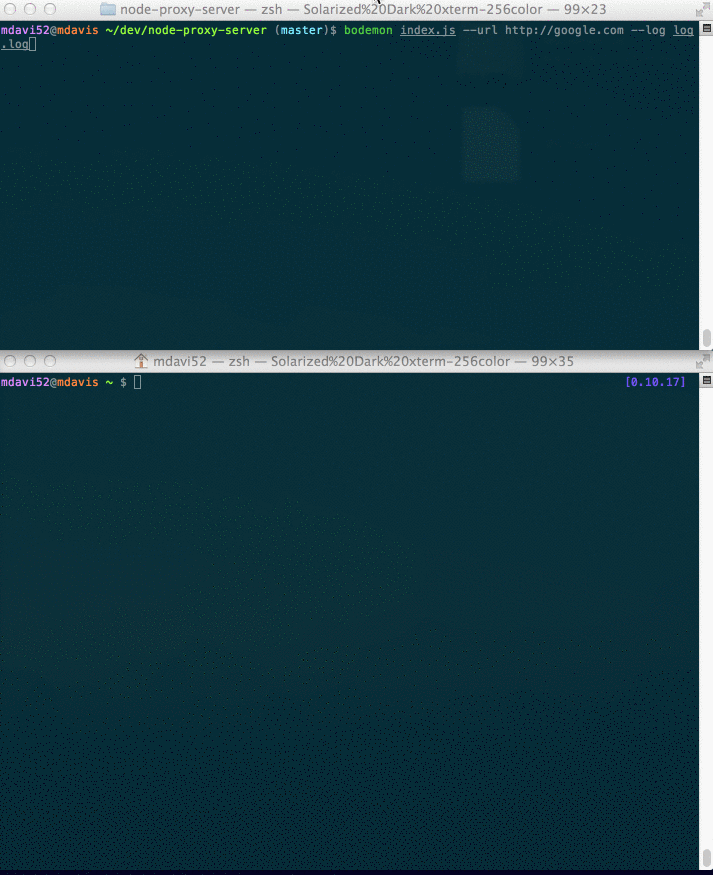

### Sweet Sweet Proxy and Echo Server

#### Run
```
npm install
bodemon index.js  [options]
```

#### Options
Option | Default
--- | ---
`--port` | 80 (8080 if localhost)
`--host` | 127.0.0.1
`--url` |
`--log` | Log to `process.stdout`


#### Demo

